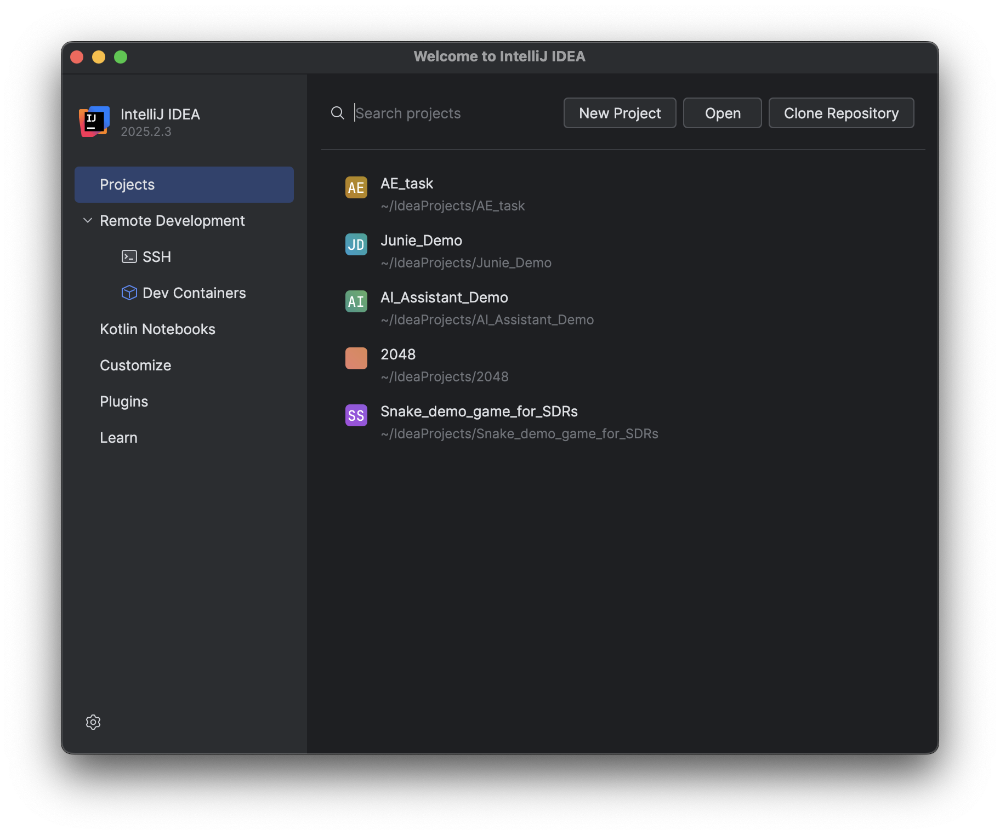
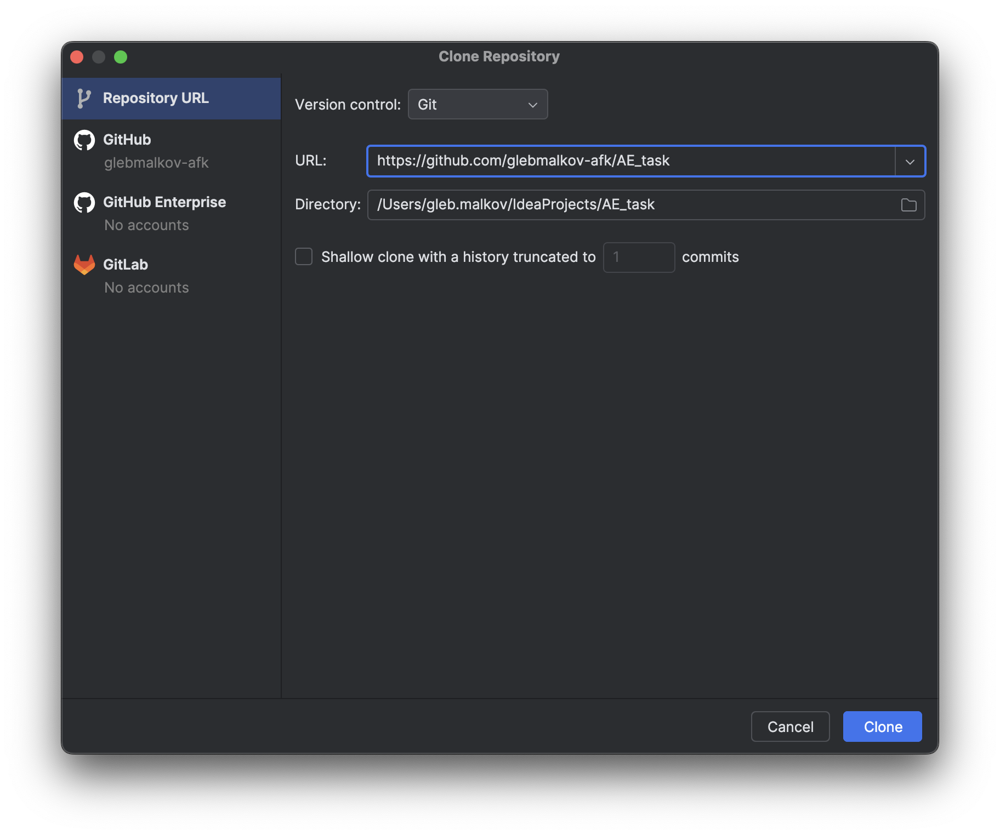
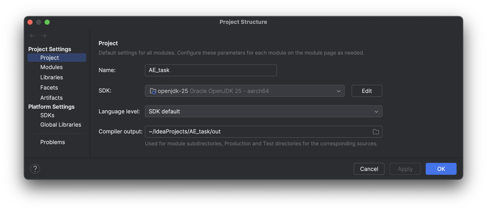
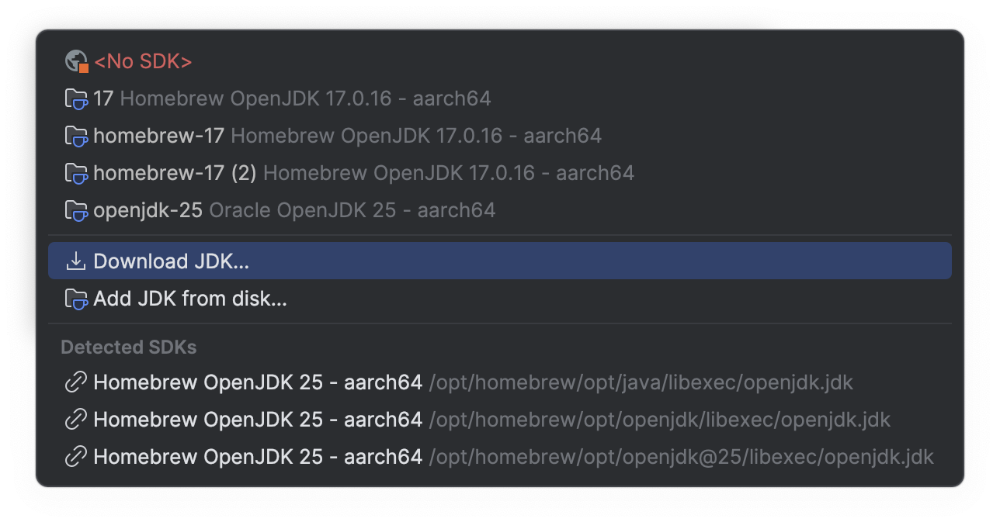
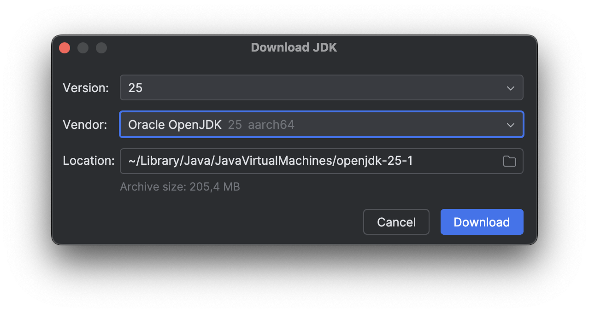

# AE Candidate Task Pack

This pack contains **two tasks**:
1) A **Baseline IDE task** on a tiny Java project from a public repository.
2) An **Advanced task with Junie** to build a minimal Snake game.

---

## Task 1 — Baseline IDE Task

**Goal:** Show that you can open a tiny Java project in IntelliJ IDEA, run it, make two trivial edits, and use one core IDE feature.

### Prerequisites
- IntelliJ IDEA Community Edition installed.
- Tutorial: https://drive.google.com/file/d/1sue0fRLnSi8xioBN1awJ0eSnY5-W_XsJ/view

### What to do
1. **Open & Run**
   - Clone the repository:
     ```
     https://github.com/glebmalkov-afk/AE_task
     ```
>  
   

> Tip #1: If you don’t have Git installed and configured, then:
> 1. Open the repo page → click <strong>Code</strong> → <strong>Download ZIP</strong>.
> 2. Unzip it locally.
> 3. In IntelliJ IDEA: <strong>File → Open…</strong> → select the unzipped project folder.
> 4. Run <code>Main</code>.

   - Open the project in **IntelliJ IDEA**.
   - Run the `Main` class and confirm it prints:
     ```
     Hello, World!
     ```
2. **Make Two Tiny Changes**
   - Change the message to **exactly**:
     ```
     Hello, JetBrains!
     ```
   - Add one more line that prints the year (hard-coded is fine, e.g., `System.out.println("2025");`).

> Tip #2: If you don’t have a JDK configured, let the IDE guide you. IntelliJ: File → Project Structure → SDK → Download
> JDK → select the supported JDK. Download, Click Apply → Ok. No tests/build tools/plugins required for this task.



---

## Task 2 — Advanced: Build a Minimal Snake Game with Junie (AI)

**Goal:** Use **Junie** inside IntelliJ IDEA to bootstrap a minimal playable Snake game and iterate once based on your own feedback.

### Prerequisites
- You will be provided with a **temporary AI subscription** (AIU/Junie access). If you cannot access Junie for any reason, reach out to a hiring manager.
- IntelliJ IDEA Ultimate installed.

### What to do
1. **Create a new project** (Java).
2. **Setup Junie** In IntelliJ: 
   - Settings/Preferences → Plugins → Marketplace.
   - Search “Junie”.
   - Click Install → Restart IDE.
   - If prompted, sign in with your trial account; verify AI Pro is active.

> Tip #3: You may request for a trial account from a hiring manager or any other person involved in the interviewing
> process.
3. **Prompt Junie** to scaffold a minimal Snake game with:
   - Keyboard controls for direction.
   - Food spawning and score increment.
   - Game over when the snake hits itself or a wall.
4. **Run the game.** Confirm it launches and responds to input.
6. **(Optional polish)**: Add a README.md (1–2 paragraphs) describing what you asked Junie, what it generated, and the improvement you added.
